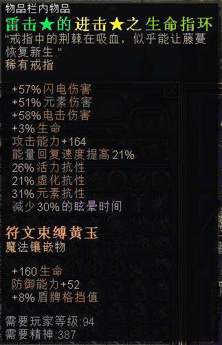

# photo-viewer
基于jquery图片查看, 拖动, 缩放,旋转
1.样式文件
<head>
    <link rel="stylesheet" type="text/css" href="css/photo-viewer-1.6.0.css" />
</head>

2.html 结构如下：

    

        <ul>
            <li class="img" img-url="img/1-b.jpg"></li>
            <li class="img" img-url="img/2-b.jpg"></li>
            <li class="img" img-url="img/3-b.jpg"></li>
            <li class="img" img-url="img/4-b.jpg"></li>
            <li class="img" img-url="img/5.png"></li>
        </ul>
    

    
3.需要引用的js
 
    
    
    
    
4.调用
       
    
5.说明

   缩略图包含属性:img-url,即原图地址, 如上 li 的父级 ul 中有5个子节点, 所以这5张图片将作为一组。
   缩略图可以用 li 或别的标签包裹，或者直接写成
   

      < img class="img" img-url="图片地址" src="缩略图"/>
      ...
   

   
  ps:
   class="img" 最好是block或inline-block, 否则点击缩略图时，图片动画可能不是从小图处出现的。
   
   demo: http://s1.jk390.com/photoviewer/demo-1.6.0.html

 
    
